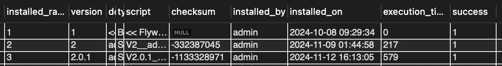

DB Flyway와 SpringBoot를 쓰는 환경에서 Test DB(H2), 운영 DB(MySQL) 구문 오류 해결 과정

저는 운영 중인 웹 시스템 abcdedu에 flyway기능을 도입하였습니다.

그래서 오늘은 해당 기능의 도입을 통해 얻은 장점과 맞이한 문제점에 대해 얘기해보고 그 해결과정을 설명하려고 합니다.

### 목차

1. DB 마이그레이션 Flyway란?
2. 실제로 사용하고 느낀 Flyway 장점
3. 겪은 오류와 해결방법
4. 결론

## 1. Flyway란?

데이터베이스 마이그레이션 툴입니다. 스키마와 데이터의 버전을 관리하는데 사용됩니다.

*참고) 우리가 흔히 알고 있던 데이터 마이그레이션과 혼동될 수 있습니다. 보통 데이터 마이그레이션은 **데이터를 한 시스템에서 다른 시스템으로 이전하는 것**을 말하지만 이 글에서는 **관계형 데이터베이스 스키마 관리하는 것**만을 의미 합니다.

### Flyway 주요 특징

1. 데이터베이스 변경 관리
    - SQL 스크립트나 Java 기반 마이그레이션 파일로 데이터베이스 스키마를 관리합니다.
2. 버전 관리
    - 각 마이그레이션 파일명에 버전을 지정하여 순차적으로 적용합니다.
    - 이미 적용된 마이그레이션은 다시 실행되지 않습니다.
3. 자동화
    - CI/CD 파이프라인에서 Flyway를 통합하여 데이터베이스 변경을 자동화할 수 있습니다.
4. 광범위한 DB 지원
    - MySQL, PostgreSQL, Oracle, SQL Server 등 다양한 데이터베이스를 지원합니다.
5. 간단한 사용법
    - SQL 파일만으로 쉽게 시작 가능.
    - Java를 사용하여 커스텀 마이그레이션 로직 구현 가능.
6. 기타
    - 자동 생성되는 `flyway_schema_history` table을 통해 버저닝 상태 등 정보를 확인 가능
    - `Checksum`을 통해 마지막에 적용된 버전이 어떤건지 표시하고, 대조를 통해 이중 확인
    - `Baseline` 설정을 통해 기존에 데이터베이스가 있는 경우, 기준점을 설정하여 Flyway를 도입할 수 있습니다.

### Flyway와 Liquibase 비교

Flyway와 같은 기능을 하는 도구로 Liquibase가 자주 나옵니다. 여러 비교사항이 있지만, 간단히 요약하자면 아래와 같습니다.

Flyway

- 학습곡선이 비교적 낮음
- 복잡한 마이그레이션이나 롤백 기능이 제한적
- 상대적으로 성능이 빠르고 가벼움
- 비교적 간단한 데이터베이스 변경 관리가 가능

Liquibase

- 복잡하지만 강력한 기능을 가짐
- 롤백 기능이 기본 제공되며  조건부 실행과 같은 복잡한 마이그레이션 가능
- 다양한 포맷 (XML, YAML, JSON) 지원
- 상대적으로 성능이 느림
- 상태 추적이 중요한 대규모 프로젝트에 적합

필자가 관리하는 웹 시스템의 경우, 아직 초기 단계이고 규모가 크지 않고 처음으로 스키마 형상 관리 툴을 사용하기 때문에 Flyway를 선택하였습니다.

### 적용방법

필자는 springboot를 사용하고 있어, application.yml 설정을 통해 연결해주었습니다.

```yaml
spring:
  flyway:
    enabled: true
    locations: classpath:db/migration
```

또한 SQL 기반으로 한 파일들을 `src/main/resources/db/migration` 해당 경로에 두어 사용했습니다.

특징에서 살펴봤듯이, Java 기반 마이그레이션도 가능합니다.

```java
public class V2__AddEmailColumn extends BaseJavaMigration {
    @Override
    public void migrate(Context context) throws Exception {
        try (Statement statement = context.getConnection().createStatement()) {
            statement.execute("ALTER TABLE users ADD COLUMN email VARCHAR(255);");
        }
    }
}
```

하지만 SQL 방식이 더 간단하고 DB 친화적인 방법이라 생각하여 SQL방식을 사용했습니다.

## 2. 실제로 사용하고 느낀 Flyway 장점

### 1. 어떤 변경인지 주석이나 파일명으로 설명이 가능하다.

이전 회사에서 인사 시스템을 개발하며 어려웠던 점이 테이블 필드 중 어떤 필드가 사용되는 것이며 왜 필요한지 DB만으론 파악이 불가능하다는 점이 있었습니다. 필요 없어 보여도 어느 코드에서 사용 되고 있을지 몰라 삭제를 결정하기도 애매했습니다.

하지만 해당 기능을 사용함으로써, 어느 시점에 왜 필드가 추가 되고 변경 되었는지 추적을 해볼 수 있을 것 같다고 생각했습니다.

SQL script에 아래와 같이 주석으로 필드를 생성한 이유를 적어놓는다면, 필요 없어지는 시점이나 변경해야할 시점도 파악하기 쉬울 것입니다.

```mysql
-- 연말정산 이벤트를 위한 임시 필드 생성. 23년 2월 이후로 삭제할 수 있음
ALTER TABLE member
   ADD COLUMN is_attend BOOLEAN DEFAULT 0;
```

### 2. 자동 생성되던 내용들을 쿼리로 정리하며 SQL문에 친숙해진다.

JPA, JPA DATA 과 같은 기능을 사용하다 보면 Entity를 만들면 해당 내용에 따라 쿼리문을 자동으로 만들어 줘서 스키마에 대한 개념을 깊게 생각해보지 못했던 부분이 있었습니다.

이를 형상 관리 파일에 쿼리문으로 일일이 표시해주다 보니 테이블을 더 잘 이해할 수 있는 장점이 있었습니다.

---

한 달정도 사용해 본 장점이라 내용이 짧습니다. 추후 더 사용해보고 규모가 커졌을 땐 어떻게 동작하는지 확인하여 추후 블로깅에 더 추가해보도록 하겠습니다.

## 3. 겪은 오류와 해결방법

### 이미 적용된 마이그레이션은 다시 실행되지 않으며 이미 적용된 버전보다 낮은 파일은 무시합니다.

`V2__test.sql`을 만들어 배포 했는데, 실수로 쿼리를 잘 못 만들어서 수정해야 하는 상황이 생겼습니다. 필자는 이를 간단히 해결하고 싶었습니다.. 그래서 커다란 실수를 저지르고 말았습니다.

1. `V2__test.sql`을 수정한 뒤 다시 push
2. DataBase에서 `flyway_schema_history` 테이블에 해당 버전(V2)을 뜻하는 행을 삭제

다시 올바르게 작성해서 올린 SQL 스트립트는 과연 실행이 되었을까요?

정답은 `checksum`이 일치하지 않는다며 실행 실패 한다 입니다.

```
ERROR: Validate failed: Detected resolved migration not applied to database

```

아래 이미지는 `flyway_schema_history` 테이블을 select 한 결과입니다.



Checksum이라는 필드가 보일 것입니다. Flyway는 이 checksum을 기억해두었다가 현재 파일의 checksum을 비교하게 됩니다. 제가 임의로 최신 버전의 스크립트 파일의 행을 삭제했기 때문에 checksum 확인 과정에서 에러가 발생한 것입니다.

- Flyway Checksum 동작 과정
    1. 마이그레이션 파일 읽기
    2. Checksum 계산
    3. `flyway_schema_history` 테이블 비교
    4. 결과
        - 일치 : checksum이 테이블의 값과 동일하면, Flyway는 해당 파일이 변경되지 않았다고 판단하고, 새 마이그레이션을 계속 진행합니다
        - 불일치 : **checksum** 값이 다르면 에러를 발생시키고 마이그레이션을 중단

### 해결 방법

해결방법은 두가지가 있습니다.

- 틀린 스크립트 파일보다 높은 버전으로 수정하는 새로운 파일을 만들어 스키마를 수정한다. (권장)
- `flyway repair` 명령을 통해 checksum을 업데이트 한다 (신뢰성 관련으로 비권장)

필자는..이미 DB에서 행을 삭제하였으므로 repair를 사용했습니다. 이 글을 읽으신 여러분들은 꼭 소제목인 `이미 적용된 마이그레이션은 다시 실행되지 않으며 이미 적용된 버전보다 낮은 파일 무시합니다.` 상기하셔서 저 같은 실수는 안 하시길 바라겠습니다.

역시 DB는 함부로 건드는 것이 아닙니다 ㅠㅠ

### 어처구니 없이 H2 쿼리문을 틀려 2주를 헤맸습니다.

두번째 사연은 제가 정말 정말,, 해결 후 쾌재를 부르면서도 황당했던 에러입니다.

결론부터 말씀드리면, TEST DB로 사용하고 있는 springboot 내장 서버인 H2 데이터베이스가 `ADD COLUMN` 시 다중 문장을 인식하지 않아 에러를 발생시켰습니다.

에러로그가 단순히 H2 관련 구문오류다. 하고 떴기 때문에 저는 H2와 MYSQL의 스크립트 호환성 문제인가 하고 해당 가정을 통한 해결방법을 열심히..찾느라 더 미궁으로 빠졌습니다.. *허허

- 문제 쿼리

```sql
-- 스키마 수정 : 생성일자, 수정일자 필드 추가
ALTER TABLE homeworks
    ADD COLUMN created_at TIMESTAMP,
    ADD COLUMN updated_at TIMESTAMP;
```

- 에러 해결 쿼리

```sql
-- 스키마 수정 : 생성일자, 수정일자 필드 추가
ALTER TABLE homeworks
    ADD COLUMN created_at TIMESTAMP;

ALTER TABLE homeworks
    ADD COLUMN updated_at TIMESTAMP;
```


이를 발견한 계기는, 2주를 혼자 앓던 끝에 같은 백엔드 개발자님께 SOS를 쳤는데 같이 이것저것 알아보다가 쿼리 자체에 집중해보기로 하였고, IDE가 잘못된 쿼리문에 대해 인식을 하지 못한다는 듯 `updated_at` 필드만 무채색으로 띄었습니다.

이를 통해 혹시 이중 구문을 인식 못하나? 라는 의견을 제시해주셨고 그게 맞았습니다.. (이 자리를 빌어 동천님께 다시 한번 인사를 드립니다ㅠㅠ)

H2 데이터베이스는 SQL 표준에서 다중 `ADD COLUMN` 구문을 명확히 지원하지 않으므로, 이를 개별 구문으로 나누어 작성해야 합니다.


## 결론

Flyway 기능, 특징, 장점, 겪을 수 있는 에러와 해결방안에 대해 알아보았습니다.

Flyway는 유용한 기능임에는 확실하지만 이렇게 에러를 발생 시킬 확률도 올릴 수 있습니다. 실제로 최근 개발 도중 코드 관련보다 flyway 에러를 훨씬 많이 만났습니다.

하지만 좋은 신 기술을 어렵다는 이유로 사용하지 않으면 참된 개발자가 아니겠죠.

Flyway 도입 초기에 에러가 잦았던 경험은 결국 데이터베이스 변경 관리를 더 깊이 이해하고, 프로젝트에 더 잘 적응할 수 있도록 해준 중요한 과정이 될 것입니다.

작은 프로젝트에서 먼저 사용해보고 여러 에러를 접하다 보면 좋은 점만 살릴 수 있는 개발도 뚝딱 할 수 있을 것입니다 !

오늘도 글 읽어주셔서 감사합니다 :-)

틀린점이 있거나, 의견 있으시면 댓글로 언제든지 말씀해주세요!


